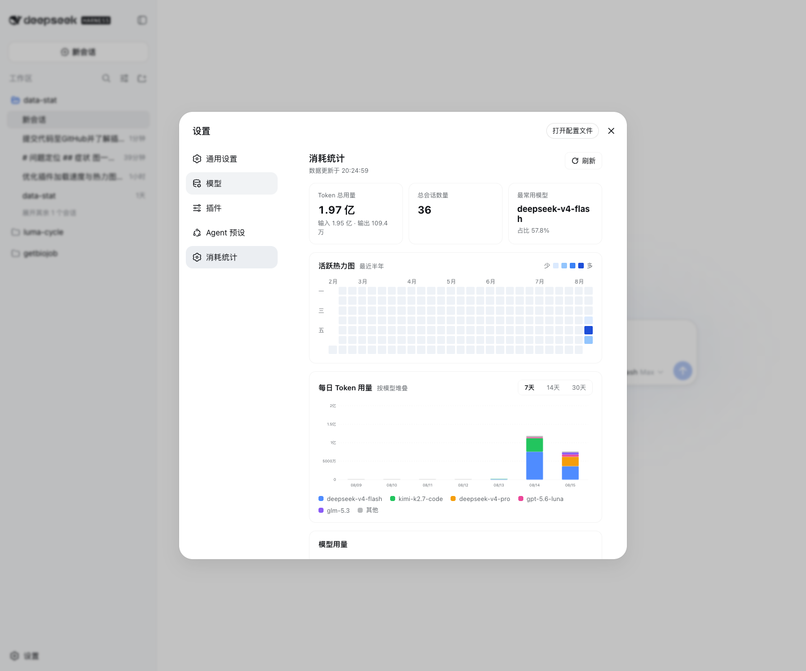
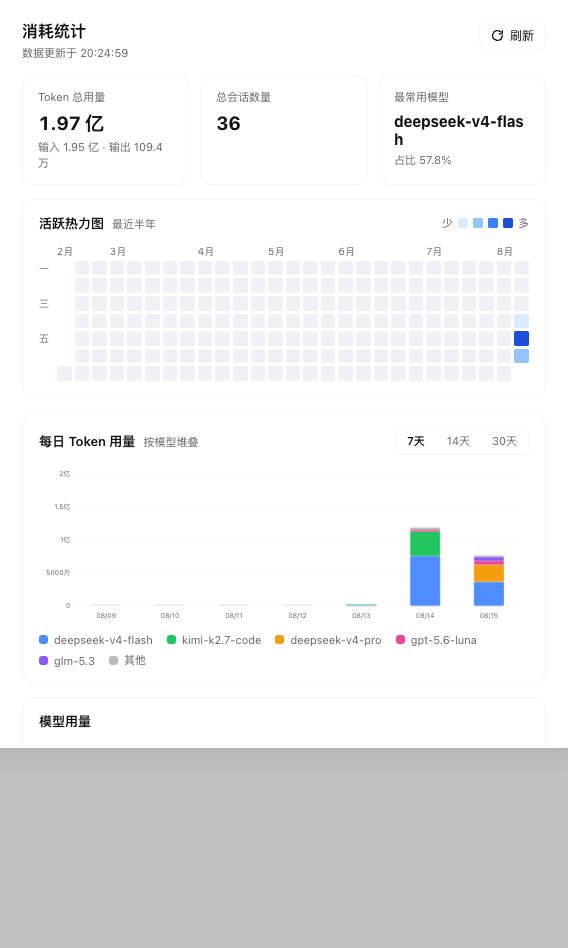
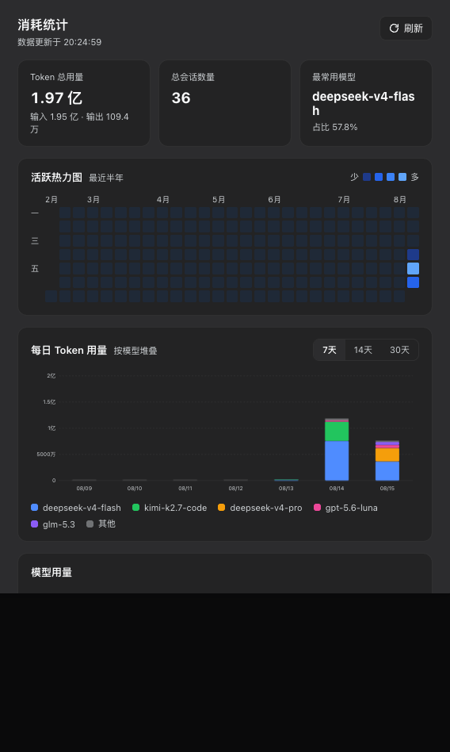

<div align="center">

# 📊 dsh-usage-stats

**DeepSeek Harness 消耗统计插件** —— 在 Web GUI 设置页直观展示你的 Token 使用情况

一个动态 Cordis 插件（Host + Client），只读重算会话日志，不写任何文件，能统计插件安装前的历史用量。

[](https://github.com/topics/dsh-plugin)
[](LICENSE)
[](package.json)
[](package.json)



</div>

## ✨ 特性

- **📈 全量 KPI** —— Token 总用量（输入 / 输出拆分）、总会话数量、最常用模型及占比，入场带计数动画
- **🗓️ 活跃热力图** —— 最近半年，GitHub 贡献图式布局：列为周、行为星期（一~日），带月份与星期标注；按非零日用量的四分位分 4 级色阶（亮 / 暗主题各一套色板），悬停看明细
- **📊 每日柱状图** —— 按模型堆叠分色，默认最近 7 天（可切 7 / 14 / 30 天），悬停看每日分模型明细
- **🍩 模型用量** —— 左侧环形图（中央为 Token 总量），右侧 Top5 模型列表，其余合并为「其他」
- **🌓 双主题** —— 全部使用 `--dsw-alias-*` 语义变量，自动跟随全局亮 / 暗主题
- **⚡ 打开即得** —— 启动预热 + stale-while-revalidate + 定时保鲜，设置页永远秒开
- **🔒 只读安全** —— 只重算持久化会话日志，不写文件、不改任何会话数据

## 📸 截图

| 浅色主题 | 暗色主题 |
| --- | --- |
|  |  |

## 🚀 安装

> 前置：已安装 [DeepSeek Harness](https://github.com/deepseek-ai/deepseek-harness) 与 `pnpm`（`dsh plugin` 转发给 pnpm）。推荐使用带 Web 界面的 profile（如 `web`）。

**方式一：GitHub 直接安装（推荐）**

```sh
dsh plugin --profile web add github:AlfredChaos/dsh-usage-stats
```

本包的 `lib/*.js` 是已提交的纯 JavaScript 产物，无构建步骤，因此不需要 `prepare` 脚本，也不涉及 pnpm 的 `allowBuilds` 构建放行。

**方式二：本地路径**

```sh
dsh plugin --profile web add ./dsh-usage-stats
```

**方式三：npm registry**（发布后）

```sh
dsh plugin --profile web add dsh-usage-stats
```

安装后重启 `dsh --profile web`，在 **设置 → 消耗统计** 查看。卸载：

```sh
dsh plugin --profile web remove dsh-usage-stats
```

> 只有声明了 `dsh.bundle.patch` 的包才会成为 profile 的激活层；本包已声明，`dsh plugin add` 会自动追加到 `dsh.profile.bundles`。

## 📖 使用

打开 **设置 → 消耗统计**，页面自上而下包含：

1. **基础数据（全部历史）** —— Token 总用量（含输入 / 输出拆分）、会话数量、最常用模型及占比
2. **活跃热力图** —— 最近半年的每日用量分布，绿色色阶由四分位自动分级，鼠标悬停查看具体日期与用量
3. **每日 Token 用量** —— 按模型堆叠的柱状图，右上角切换 7 / 14 / 30 天窗口
4. **模型用量** —— 环形图 + Top5 列表（含「其他」合并行），悬停环形图查看占比
5. **刷新按钮** —— 右上角，强制重新扫描会话日志

## ⚙️ 工作原理

### 数据来源（只读重算，无需落盘）

- 统计从持久化会话日志重算（`sessionQuery` 只读服务）：
  - `request/header` / `request/context` 事件记录当时使用的模型；
  - `assistant/message` 事件携带该步骤的 `TokenUsage`（输入 / 输出 / 缓存读 / 缓存写）；
  - 事件自带时间戳，按天分桶。
- 子会话（fork）通过 `header.seedLength` 跳过继承的父历史，避免重复计数。
- 不写任何文件：跨进程重启数据不丢，且能统计插件安装前的历史用量。

### 缓存与加载策略（启动预热，打开即得）

- **启动预热**：Host 半在插件加载时立即开始首次扫描，用户打开页面时数据通常已在缓存中，无需等待冷扫描。
- **stale-while-revalidate**：缓存 10 分钟内视为新鲜直接返回；更旧的缓存立即返回并标记 `stale: true`（副标题显示「后台更新中…」），同时 Host 在后台重扫刷新缓存。
- **定时保鲜**：每 10 分钟轻量重扫一次，缓存不会久置变旧。
- 点「刷新」按钮始终强制同步重扫。

### 单位

自适应：≥ 1 亿 用「亿」，≥ 1 万 用「万」，否则显示原值。

## 🛠️ 实现

| 文件 | 说明 |
| --- | --- |
| `lib/index.js`  | Host 半（Cordis 插件入口，`name` / `inject` / `apply`）：会话日志扫描、聚合、RPC 缓存与预热 |
| `lib/client.js` | Client 半（`./client` 导出，`__ModuleLoader__` bundle）：设置页 UI（React.createElement + SVG 图表，`--dsw-*` 主题变量） |
| `cordis.patch.yml` | bundle patch：向 profile 组合插入 `usage-stats` 行 |

- 通信：Host 经 `ctx.connection.rpc.handle('/usage-stats', …, { authority: 'loopback' })` 提供 `overview` 端点，浏览器经 `rpc.call('/usage-stats', 'overview', …)` 拉取。
- 兼容性：在 DeepSeek Harness `0.1.0-rc.6` 上开发验证。

## 📄 License

[MIT](LICENSE) © AlfredChaos
