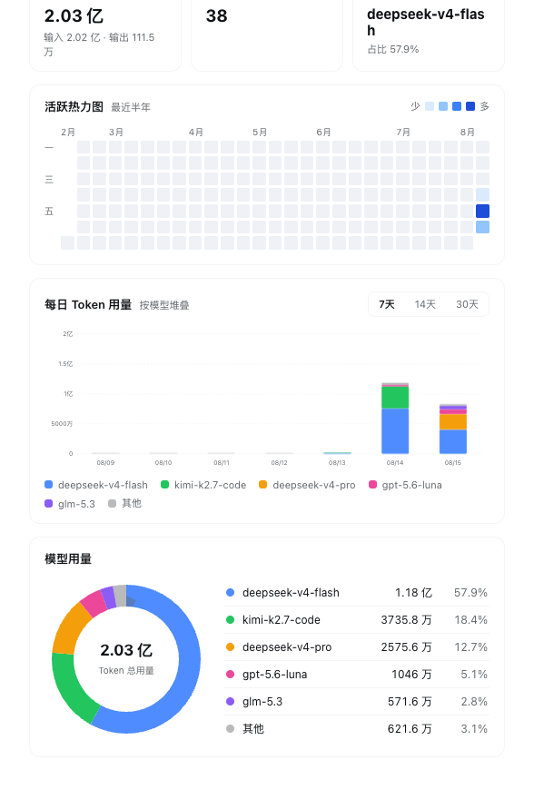
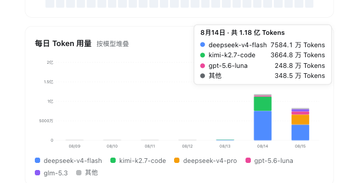
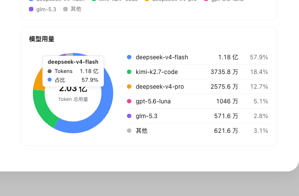
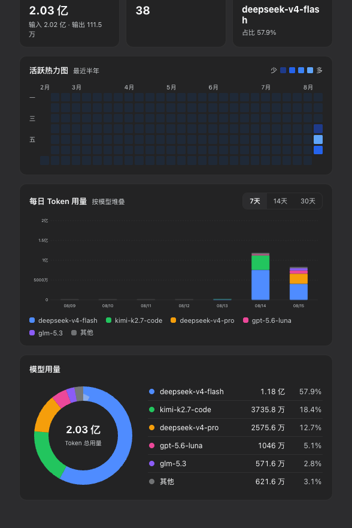

<div align="center">

# dsh-usage-stats

Token usage statistics for [DeepSeek Harness](https://github.com/deepseek-ai/deepseek-harness), shown as a page under **Settings → Usage** in the web GUI. The plugin rescans persisted session logs and never writes anything back.

[简体中文](README.zh-CN.md) · [](https://github.com/topics/dsh-plugin) [](LICENSE) [](package.json)



</div>

## What it shows

- **Cumulative totals (all time)** — input and output tokens, session count, and the most-used model with its share.
- **Activity heatmap** — the last six months in a GitHub-contribution layout (weeks as columns, weekdays as rows). Days are colored by quartile over non-zero usage.
- **Daily stacked bars** — per-model token usage, switchable between the last 7, 14, or 30 days.
- **Model donut** — all-time share per model, with the top 5 listed beside it and the rest folded into "other".

Hovering a bar or a donut segment shows the exact breakdown:

| Bar tooltip | Donut tooltip | Dark theme |
| --- | --- | --- |
|  |  |  |

## Install

The plugin ships as a bundle: `dsh plugin add` appends it to the profile's bundle list, and the patch row activates the host half.

```sh
# from GitHub
dsh plugin --profile web add github:AlfredChaos/dsh-usage-stats

# or from a local checkout
dsh plugin --profile web add ./dsh-usage-stats
```

Restart `dsh --profile web` and open **Settings → Usage**. The package contains plain JavaScript under `lib/` — there is no build step, so git installs work without pnpm build allowances. To remove it:

```sh
dsh plugin --profile web remove dsh-usage-stats
```

## Where the numbers come from

The host half rescans persisted session logs through the read-only `sessionQuery` service:

- `request/header` and `request/context` events record the model in use for each step;
- `assistant/message` events carry that step's `TokenUsage` (input, output, cache read, cache write);
- events are timestamped and bucketed per day.

Forked sessions are deduplicated through `header.seedLength`. Because nothing is written, statistics survive restarts and cover sessions from before the plugin was installed.

## Loading behavior

The first scan starts as soon as the plugin loads, so the page usually renders straight from cache. A payload is considered fresh for 10 minutes; older ones are returned immediately with a `stale` flag (the page shows "updating in background") while a rescan refreshes the cache. A keep-warm timer rescans every 10 minutes, and the refresh button always forces a synchronous scan.

## Units

Values adapt to Chinese magnitudes: `亿` (10⁸) and `万` (10⁴), plain numbers otherwise.

## Implementation

| File | Role |
| --- | --- |
| `lib/index.js` | Host half (Cordis plugin): session-log scan, aggregation, cached RPC with warm-up |
| `lib/client.js` | Client half (`./client` export, `__ModuleLoader__` bundle): settings-page UI built with `React.createElement` and SVG, styled with `--dsw-*` tokens |
| `cordis.patch.yml` | Bundle patch: inserts the `usage-stats` row into the profile composition |

The host serves an `overview` endpoint through `ctx.connection.rpc.handle('/usage-stats', …, { authority: 'loopback' })`; the browser calls it via `rpc.call('/usage-stats', 'overview', …)`. Developed against DeepSeek Harness `0.1.0-rc.6`.

## License

[MIT](LICENSE)
