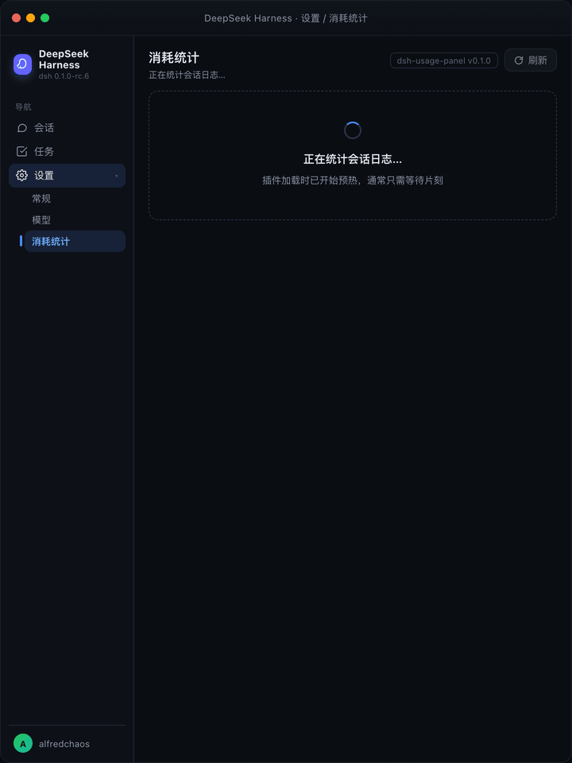

<div align="center">

# dsh-usage-panel

[DeepSeek Harness](https://github.com/deepseek-ai/deepseek-harness) 的 Token 用量统计插件，在 Web GUI 的「设置 → 消耗统计」下展示。插件只重算持久化的会话日志，不会写回任何数据。

[English](README.md) · [](https://www.npmjs.com/package/dsh-usage-panel) [](https://github.com/topics/dsh-plugin) [](LICENSE) [](https://github.com/0xsline/awesome-deepseek-harness)



</div>

## 页面内容

- **汇总数据（全部历史）** —— 输入 / 输出 Token 用量、会话数量、最常用模型及其占比。
- **活跃热力图** —— 最近半年，GitHub 贡献图式布局（列为周、行为星期）。按非零日用量的四分位分 4 级色阶。
- **每日柱状图** —— 按模型堆叠的每日用量，可切换最近 7 / 14 / 30 天。
- **模型环形图** —— 各模型全历史占比，旁边列出前 5 名，其余合并为「其他」。

悬停柱子或环形图分段可以看到具体明细：

| 柱状图悬停 | 环形图悬停 | 暗色主题 |
| --- | --- | --- |
|  |  |  |

## 安装

插件以 bundle 形式发布：`dsh plugin add` 会把它追加到 profile 的 bundle 列表，patch 行负责挂载 Host 半。

```sh
# 从 npm 安装（推荐）
dsh plugin --profile web add dsh-usage-panel

# 或从 GitHub 安装
dsh plugin --profile web add github:AlfredChaos/dsh-usage-panel

# 或从本地目录安装
dsh plugin --profile web add ./dsh-usage-panel
```

重启 `dsh --profile web`，打开「设置 → 消耗统计」。npm 包内 `lib/` 下是预构建的纯 JavaScript 产物，无安装脚本；GitHub 安装同样不需要 pnpm 的构建放行，因为仓库里提交了相同的文件。卸载：

```sh
dsh plugin --profile web remove dsh-usage-panel
```

## 数据来源

Host 半通过只读的 `sessionQuery` 服务重扫持久化会话日志：

- `request/header` 与 `request/context` 事件记录每一步使用的模型；
- `assistant/message` 事件携带该步骤的 `TokenUsage`（输入、输出、缓存读、缓存写）；
- 事件自带时间戳，按天分桶。

子会话（fork）通过 `header.seedLength` 去重。因为不写任何文件，统计在重启后依然存在，也能覆盖插件安装之前的历史会话。

## 加载策略

插件加载时立即开始首次扫描，打开页面时通常直接命中缓存。缓存 10 分钟内视为新鲜；更旧的缓存会立即返回并标记 `stale`（页面显示「后台更新中…」），同时后台重扫刷新。每 10 分钟定时轻量重扫保鲜，刷新按钮始终强制同步重扫。

## 单位

自适应：≥ 1 亿 用「亿」，≥ 1 万 用「万」，否则显示原值。

## 实现

| 文件 | 说明 |
| --- | --- |
| `lib/index.js` | Host 半（Cordis 插件）：会话日志扫描、聚合、带预热的 RPC 缓存 |
| `lib/client.js` | Client 半（`./client` 导出，`__ModuleLoader__` bundle）：设置页 UI，`React.createElement` + SVG 实现，样式全部使用 `--dsw-*` 变量 |
| `cordis.patch.yml` | Bundle patch：向 profile 组合插入 `usage-stats` 行 |

Host 通过 `ctx.connection.rpc.handle('/usage-stats', …, { authority: 'loopback' })` 提供 `overview` 端点，浏览器经 `rpc.call('/usage-stats', 'overview', …)` 调用。基于 DeepSeek Harness `0.1.0-rc.6` 开发验证。

## License

[MIT](LICENSE)
